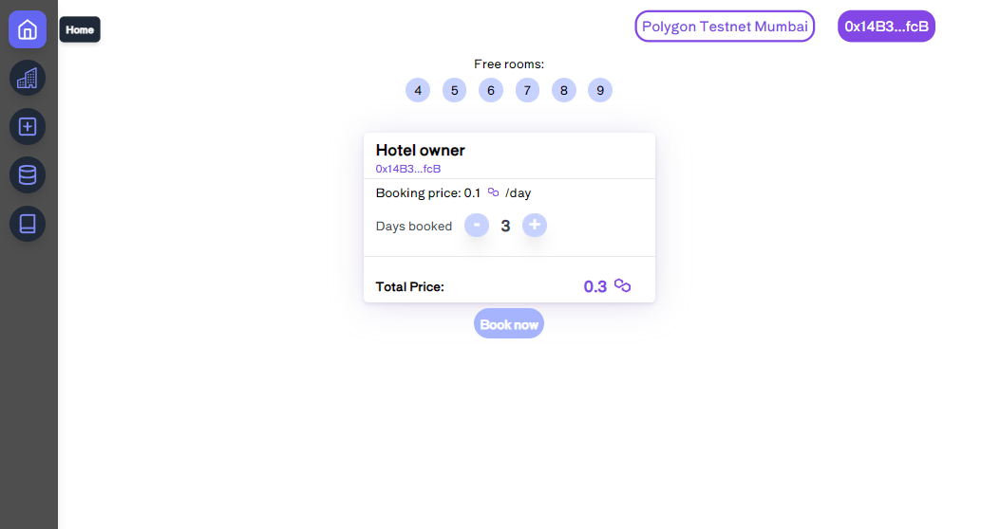

  

Visit the website on: <a  href="https://hotel-room-booking-ten.vercel.app/">hotel-room-booking-ten.vercel.app</a>

  

This website scopes to simulate what a (very) simple Hotel Booking portal for both owners and customers through a decentralized environment with Smart Contracts developed and deployed on an EVM blockchain like Matic Testnet (Mumbai).
 

  ## Tech Stack

  
🔱 **Solidity + React** - For the "backend" I used smart contracts written in Solidity and deployed on the Matic Testnet. For the frontend NextJS was used, with Tailwind CSS to make things easier.
  

## 🎁 Donating

  

-  **SOL address**: EQ4zjzotsMKmQFbXxbkj7WH4M8nzjDZ2r4r3w2stokyn

-  **BSC address**: 0x14B3D1D05D90E7Bb9EF9847E92cA11DbA10D1fcB

  

## 📣 Social network

  

- 💭 [Twitter](https://twitter.com/ESArnau) @ESArnau

  